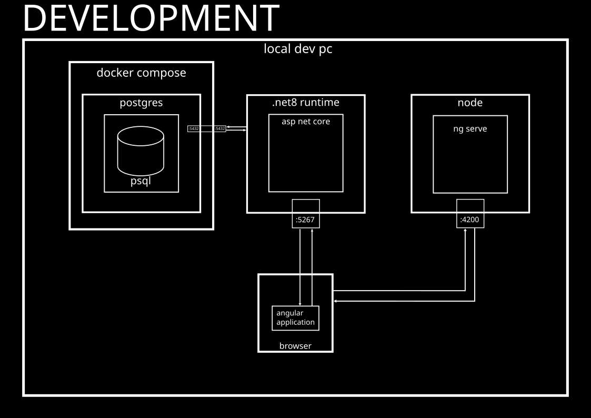
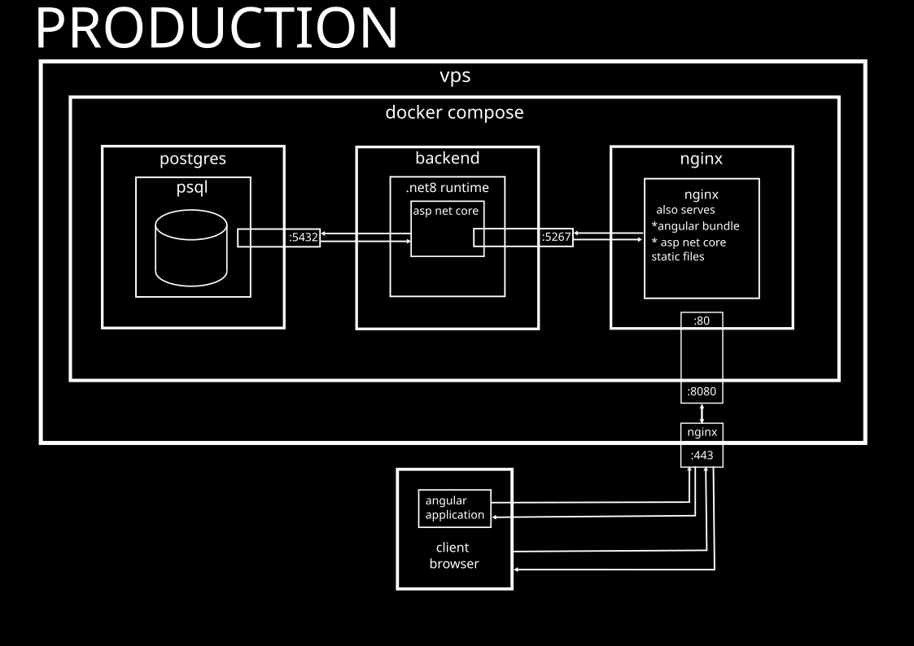

# 🎲 TaleToss

A web application for generating random visual prompts to help you create stories.<br>
Click a button to display 5 or 9 random images, then use every one of them to create a story.<br>
Useful for making language students practice speaking.

[demo](./demo.gif)

---

## Table of Contents

1. [Live Demo](#live-demo)
2. [Stack](#stack)
3. [Features](#features)
4. [Development](#development)
5. [Deployment](#deployment)
6. [Script Usage Help](#script-usage-help)
7. [Contributing & Contact](#contributing-&-Contact)
8. [License](#license)

---

## Live Demo

[Live Demo Here](https://cinardoruk.xyz/demo/taletoss)

---

## Stack

- Frontend: Angular 17
- Backend: .NET 8 ASP.NET Core
- Database: PostgreSQL
- Reverse proxy: Nginx
- Containerization: Docker Compose
- Build & deployment: Bash scripts

---

## Features

### User
-  Dynamic story-dice generation (5 or 9 images)
-  Admin authentication
-  Small admin panel for adding/deleting SVG files

### Technical
-  Angular SPA
-  Route guarding on the front end
-  JWT Bearer authentication & authorization for API endpoints
-  Role-based views (student vs. teacher login, though there is no use for student users yet)
-  Docker compose setup for easy production runs
-  Docker network use for cross container communication in production setup
-  Bash scripts that build, package, push, run, and manage the entire application

---

## Development

⚠️Development setup has not been fully containerized yet!



You'll need
* npm
* .net 8 sdk
* .net 8 runtime
* docker (to run the psql container)

do a

```bash
git clone https://github.com/cinardoruk/taletoss.git
```
to grab the repo

### Basic Development Workflow

```bash
cd frontend
npm install
ng serve
```
in one terminal

```bash
cd backend
dotnet watch
```
in another terminal

Note that dotnet watch isn't as robust as ng serve, and it's better to manually restart ASP.NET Core.

---

## Deployment

 

The production docker compose setup has these services:

* postgres
* backend
* nginx

The main steps for deployment are:

### 0. **Configure**

#### Local Configuration

   - Copy and customize the example files:
     - `deploy/.env.prod.example` → `deploy/.env.prod`
     - `deploy/.build_deploy.env.example` → `deploy/.build_deploy.env`
     - `frontend/src/environments/environment.ts.example` → `frontend/src/environments/environment.ts`
   - In `build_deploy.sh`, ensure the `--configuration` flag matches your Angular build config (e.g. `production`).
   - Configure `baseHref` and `deployUrl` in `angular.json`.
   - build_deploy.sh assumes that you use key authentication to ssh into your server.

#### Remote Configuration

It is assumed that your vps/server has a native reverse proxy where https terminates, which will route traffic to the port alloted to the 'nginx' docker container. A configuration file in `/etc/nginx/sites-available` can be used to achieve this. A detailed walkthrough is outside the scope of this text.

The default port settings in docker-compose.prod.yml exposes port 80 of the nginx container to port 8080 on the host machine, so incoming connections to the machine for TaleToss should be directed to 8080 by your reverse proxy.

### 1. Build

  ```bash
   cd deploy
   ./build_deploy.sh build
  ```
  This will:
	- Compile ASP.NET Core into deploy/release/aspnetcore/
	- Build the Angular app into deploy/release/angular/dist/


### 2. Package

  ```bash
   ./build_deploy.sh package
  ```

	This will copy the Nginx config, Docker Compose config, .env files, and helper scripts into `deploy/release` to be transferred to the remote machine alongside release files

### 3. Transfer

  ```bash
   ./build_deploy.sh release_to_vps
  ```

	This will authenticate with the remote machine you configured in `deploy/build_deploy.sh`, then use `rsync --delete` to transfer the entire `release` directory to the remote machine.

### 4. Run

	Build the images and start the Docker Compose services on the remote machine using

	```bash
	..../release/dc_start.sh up --build
	```

Ideally,

```bash
deploy/build_deploy.sh all
```
should do steps 1-4, provided that local configuration was completed.

### 5. Seed

The application comes without default images at the moment.

Login with the default admin user
```
admin@email.com
```
using the password you set up in .env.prod, then upload svgs using the view at route '/teacher'.

You can use the SVGs at `backend/Data/SeedSvgs`

if you get database problems, you can run
```bash
reset_db.sh
```
in the target directory to wipe the database. Restarting ASP.NET Core will apply migrations and seed default users/roles.

### Script Usage Help

#### build_deploy.sh

```bash
Usage: $0 [OPTIONS]

Options:

build 					build angular and asp.net core application in release/angular, and release/aspnetcore, respectively
package					copy nginx.conf, docker-compose.prod.yml, .env.prod, dc_start.sh, reset_db.sh into release/
build_and_package       build and package
release_to_vps			rsync release/ to $VPS_SSH:$VPS_WORKTREE
start_dc				start docker compose on the vps using $DOCKER_COMPOSE_FILE
all  		            Run all steps (build, package, release_to_vps, start_dc)
help        		    Display this help message

fill out the variables in build_deploy.env

WARNING: rsync is used with the --delete option. Local state will replace remote state. e.g files in the remote dir which are not on the local dir will be removed
```

#### dc_start.sh

```bash
Usage: $0 [OPTIONS]

Options:

up 		    start normally
up -d		start with -d
stop 		stop the containers
down		stop AND remove the containers
--build     force build images
help        display this help message
```

## Contributing & Contact
Contributions welcome via PRs!
Questions or feedback? Open an issue or email me at cinar.doruk@gmail.com

## License

This project is licensed under the AGPL-3.0-only.
See `LICENSES` directory for full text.

## Assets

- Icons from [Heroicons](https://github.com/tailwindlabs/heroicons) — MIT licensed
